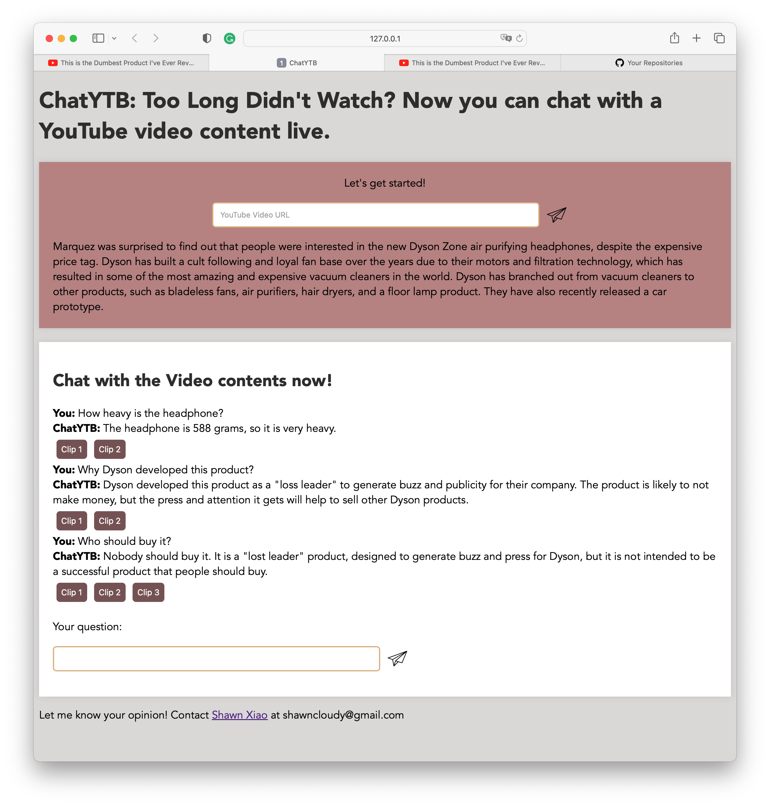

# ChatYTB

ChatYTB is an application that allows you to chat with YouTube video contents in real-time. Instead of watching long YouTube videos, you can use ChatYTB to ask questions directly to the video content and get back relevant answers. Each answer provided is also accompanied by a timestamp link to the relevant clip in the video for you to refer to. This makes it an excellent tool for extracting and understanding key information from YouTube videos.

## Screenshots

Here is a screenshot of the application:



## Features and Techniques
* **Real-time Interaction:** ChatYTB can process YouTube video content and make it interactive. You can ask any question relevant to the video content, and it will provide a concise answer.
* **Timestamp References:** Each answer from ChatYTB comes with a timestamp link to the relevant clip from the video, making it easy to refer back to the original context.
* **Utilizes NLP techniques:** ChatYTB uses the OpenAI GPT-3.5 language model to process and answer questions.
* **Transcription of Video:** The YouTube Transcript API is used to generate transcriptions of the video content for processing.
* **Frontend in Flask:** The server frontend is built using Flask, a lightweight and flexible web framework for Python.
* **Asynchronous Processing:** Transcription and processing of video content is done asynchronously, allowing the application to handle multiple requests concurrently.

## Setup

### Prerequisites

1. Python 3.6 or higher
2. Your own OpenAI API key
3. pip (Python package manager)

### Installation Steps

1. Clone this repository to your local machine.
```
git clone https://github.com/Shawn-yzXiao/chatYTB.git
```

2. Navigate to the directory of the project.
```
cd ChatYTB
```

3. Install the required Python packages using pip.
```
pip install -r requirements.txt
```

4. Replace the OpenAI API key placeholder in the app.py file with your own OpenAI API key.

5. Run the flask application.
```
python app.py
```
6. Open a web browser and navigate to `localhost:5000` to start using ChatYTB.

## Usage

1. Paste a YouTube video URL into the input field on the homepage.
2. Wait for the application to process the video content. Processing time depends on the length of the video.
3. Once the video content is loaded, you can start asking questions in the provided input field.

For any issues or suggestions, feel free to reach out to [Shawn Xiao](https://shawn-yzxiao.github.io) at shawncloudy@gmail.com. I appreciate your feedback! 

## License

This project is licensed under the MIT License - see the [LICENSE.md](LICENSE.md) file for details.
